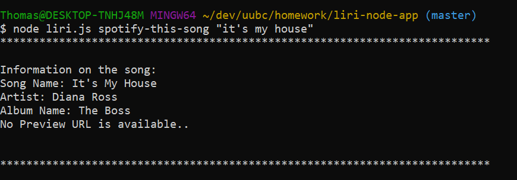

# liri-node-app

LIRI is a _Language_ Interpretation and Recognition Interface. LIRI will be a command line node app that takes in parameters and gives you back data.

LIRI will search Spotify for songs, Bands in Town for concerts, and OMDB for movies.

You can give LIRI one of the following commands to complete your search:

   * `concert-this`

   * `spotify-this-song`

   * `movie-this`

   * `do-what-it-says`

Decription of each command

`node liri.js concert-this <artist/band name here>`

This will search the Bands in Town Artist Events API for an artist and provide the following information about each event to the terminal:

    * Name of the venue
    * Venue location
    * Date of the Event (use moment to format this as "MM/DD/YYYY")

Examples: 

`node liri.js spotify-this-song '<song name here>'`

This will show the following information about the song in your terminal/bash window

    * Artist(s)
    * The song's name
    * A preview link of the song from Spotify
    * The album that the song is from

Examples:

   
`node liri.js movie-this '<movie name here>'`

This will output the following information to your terminal/bash window:

    * Title of the movie.
    * Year the movie came out.
    * IMDB Rating of the movie.
    * Rotten Tomatoes Rating of the movie.
    * Country where the movie was produced.
    * Language of the movie.
    * Plot of the movie.
    * Actors in the movie.

Examples:    

`node liri.js do-what-it-says`

LIRI will take the text inside of the file random.txt and then use it to call one of LIRI's commands.

Examples:

